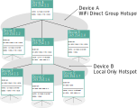

# Meshrabiya

Meshrabiya is a virtual mesh network for Android that operates over WiFi. It allows applications
to seamlessly communicate over multiple hops and multiple WiFi direct group networks using a 
"virtual" IP address (typically a random auto-generated address e.g. 169.254.x.y). It uses normal
runtime permissions that can be granted by the user and does not require root permissions.

It is intended for use in situations where multiple Android devices need to communicate with each 
other and a WiFi access point is not available e.g. schools and health clinics without WiFi 
infrastructure, when hiking, etc. WiFi enables high-speed connections with tests obtaining 300Mbps+.
Using multiple hops over multiple WiFi direct groups enables more devices to connect than is possible
using a single device hotspot.

Meshrabiya provides socket factories (for both TCP and UDP) that can create route data over multiple
hops as if they were directly connected.

How it works:

* Node A creates a hotspot [Wifi Direct Group](https://developer.android.com/reference/android/net/wifi/p2p/WifiP2pManager#createGroup(android.net.wifi.p2p.WifiP2pManager.Channel,%20android.net.wifi.p2p.WifiP2pManager.ActionListener)). 
  It generates a "connect link" that includes the hotspot SSID, passphrase, ipv6 link local address, 
  and the service port number.
* Node B obtains the connect link by scanning a QR code (this could also potentially be sent over
  Bluetooth Low Energy and/or Wifi Direct Service Discovery). Node B connects to the hotspot of 
  Node A using the [Wifi Bootstrap API](https://developer.android.com/guide/topics/connectivity/wifi-bootstrap).
  Node B sends a UDP packet to the ipv6 address / service port of Node A to enable Node A to discover
  Node B. Node A and Node B can now communicate.
* Node B creates its own hotspot. Node C (and so forth) can connect. All nodes periodically broadcast
  originator messages that include their virtual IP address and connect link. The propogation of
  originator messages is subject to limits on the maximum number of hops. When a node receives an
  originator message it knows the other node, and it knows the next hop if it wants to send traffic
  to that node. This is based on the [BATMAN Originator Message concept](https://www.open-mesh.org/doc/batman-adv/OGM.html).
* Each node can simultaneously operate both a hotspot for incoming connections and make one outgoing
  connection via its WiFi station (client). IPv6 link local addresses are used to avoid an IP conflict
  due to the fact that Android assigns the IP address 192.168.49.1 to all nodes that operate as a 
  WiFi direct group owner.



## Getting started

Add the dependency
```

```

### Connect devices

Create a Virtual Node:

```

```

Create a hotspot on one node:

```

```

Use the connect link to connect from another node:
```

```

### Connect using TCP


### Connect using UDP


### Known issues

Instrumented test debug: You must go to test settings, debug tab, and change to "java only" 
debugger type. Thank you, Google.
